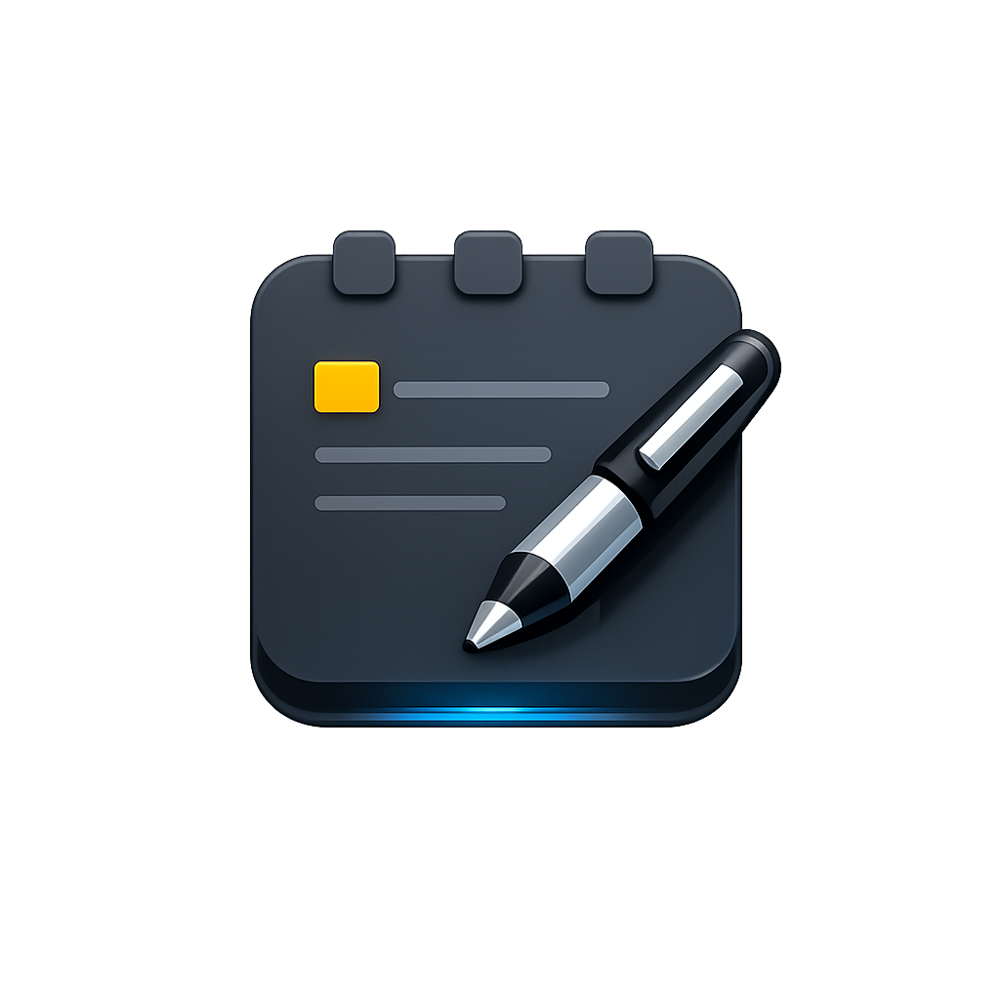

<div align="center">



# 🖋️ GhostNotepad

**A sleek, dark-themed rich notepad with built-in drawing canvas, image gallery with zoom viewer, and markdown preview.**

<br />


</div>

---

<br />

## ✨ Features

<table>
<tr>
<td>

### 📝 Rich Text Editing
- **Bold**, *Italic*, <u>Underline</u>, ~~Strikethrough~~
- Headings (H1, H2, H3)
- Bullet lists & Numbered lists
- Code blocks & Quote blocks
- Tables (3×3 with styled headers)
- Markdown preview toggle
- Find & Replace (`Ctrl+F`)
- Active state visual feedback for all toggle tools

</td>
<td>

### 🎨 Draw Canvas
- Full-screen drawing overlay
- Pen & Eraser tools (icon-based UI)
- 10+ preset colors + custom color picker
- 4 stroke thickness levels (Thin / Normal / Thick / Bold)
- Undo & Clear actions
- Strokes saved with notes as vectors (not rasterized images)
- Responsive toolbar layout

</td>
</tr>
<tr>
<td>

### 🖼️ Image Gallery + Zoom Viewer
- Add & manage multiple images per note
- Grid layout gallery panel with thumbnails
- Multi-image upload support
- **Full-screen zoom/magnify viewer** — click any image to open
- Pan, zoom in/out, fit-to-screen, reset zoom
- Delete images from the viewer
- Mouse wheel zoom & drag-to-pan support

</td>
<td>

### 📑 Tabbed Interface
- Open multiple notes in tabs
- Create new tabs with `+` button
- Quick tab switching (`Ctrl+Tab` / `Ctrl+Shift+Tab`)
- Per-tab session state & unsaved changes prompts

</td>
</tr>
<tr>
<td>

### 💾 Session Persistence
- Auto-save open tabs & session state
- Restore everything on relaunch
- Manual save (`Ctrl+S`) / Save As (`Ctrl+Shift+S`)
- Default save format: `.txt` (JSON-based rich content)

</td>
<td>

### 🖤 Dark Theme
- Sleek `#121212` dark background
- Custom frameless window with custom title bar
- Customizable background color & image per tab
- Clean, modern UI with subtle animations

</td>
</tr>
</table>

<br />

## 🛠️ Tech Stack

| Technology | Purpose |
|:-----------|:--------|
| [Electron](https://www.electronjs.org/) `v30` | Desktop application framework |
| [Node.js](https://nodejs.org/) | Backend / File system operations |
| HTML5 / CSS3 | UI rendering & responsive styling |
| Vanilla JavaScript | Application logic (no framework overhead) |
| [electron-builder](https://www.electron.build/) | Packaging & distribution (NSIS installer) |

<br />

## 📦 Installation

### Prerequisites

- [Node.js](https://nodejs.org/) (v18+)
- [npm](https://www.npmjs.com/)

### Setup

```bash
# Clone the repository
git clone https://github.com/HarshilVanparia/notes.git
cd notes

# Navigate to the app directory
cd app

# Install dependencies
npm install

# Start the application
npm start
```

### Build Windows Installer

```bash
cd app

# Build NSIS installer for Windows
npm run build
```

The installer will be generated in the `dist/` directory.

<br />

## ⌨️ Keyboard Shortcuts

<table>
<tr><th>Category</th><th>Action</th><th>Shortcut</th></tr>
<tr><td rowspan="5"><b>File</b></td><td>New Note</td><td><kbd>Ctrl</kbd>+<kbd>N</kbd></td></tr>
<tr><td>Open File</td><td><kbd>Ctrl</kbd>+<kbd>O</kbd></td></tr>
<tr><td>Save</td><td><kbd>Ctrl</kbd>+<kbd>S</kbd></td></tr>
<tr><td>Save As</td><td><kbd>Ctrl</kbd>+<kbd>Shift</kbd>+<kbd>S</kbd></td></tr>
<tr><td>Exit</td><td><kbd>Alt</kbd>+<kbd>F4</kbd></td></tr>
<tr><td rowspan="6"><b>Edit</b></td><td>Undo</td><td><kbd>Ctrl</kbd>+<kbd>Z</kbd></td></tr>
<tr><td>Redo</td><td><kbd>Ctrl</kbd>+<kbd>Y</kbd></td></tr>
<tr><td>Cut</td><td><kbd>Ctrl</kbd>+<kbd>X</kbd></td></tr>
<tr><td>Copy</td><td><kbd>Ctrl</kbd>+<kbd>C</kbd></td></tr>
<tr><td>Paste</td><td><kbd>Ctrl</kbd>+<kbd>V</kbd></td></tr>
<tr><td>Find in File</td><td><kbd>Ctrl</kbd>+<kbd>F</kbd></td></tr>
<tr><td rowspan="4"><b>View</b></td><td>Zoom In</td><td><kbd>Ctrl</kbd>+<kbd>+</kbd></td></tr>
<tr><td>Zoom Out</td><td><kbd>Ctrl</kbd>+<kbd>-</kbd></td></tr>
<tr><td>Reset Zoom</td><td><kbd>Ctrl</kbd>+<kbd>0</kbd></td></tr>
<tr><td>Shortcuts Help</td><td><kbd>?</kbd></td></tr>
<tr><td rowspan="5"><b>Draw Canvas</b></td><td>Pen Tool</td><td><kbd>P</kbd></td></tr>
<tr><td>Eraser Tool</td><td><kbd>E</kbd></td></tr>
<tr><td>Undo Stroke</td><td><kbd>Ctrl</kbd>+<kbd>Z</kbd></td></tr>
<tr><td>Close Canvas</td><td><kbd>Esc</kbd></td></tr>
<tr><td>Image Gallery</td><td><kbd>Ctrl</kbd>+<kbd>Shift</kbd>+<kbd>I</kbd></td></tr>
<tr><td rowspan="3"><b>Image Viewer</b></td><td>Zoom In</td><td><kbd>+</kbd> / Mouse Wheel</td></tr>
<tr><td>Zoom Out</td><td><kbd>-</kbd> / Mouse Wheel</td></tr>
<tr><td>Close Viewer</td><td><kbd>Esc</kbd></td></tr>
<tr><td rowspan="4"><b>Formatting</b></td><td>Bold</td><td><kbd>Ctrl</kbd>+<kbd>B</kbd> / Toolbar</td></tr>
<tr><td>Italic</td><td><kbd>Ctrl</kbd>+<kbd>I</kbd> / Toolbar</td></tr>
<tr><td>Underline</td><td><kbd>Ctrl</kbd>+<kbd>U</kbd> / Toolbar</td></tr>
<tr><td>Tab</td><td><kbd>Tab</kbd> (inserts 4 spaces)</td></tr>
</table>

<br />

## 📂 Project Structure

```
notes/
├── .gitignore
├── README.md
└── app/
    ├── main.js           # Electron main process (window, IPC, file dialogs)
    ├── preload.js         # Context bridge (secure IPC between main & renderer)
    ├── renderer.js        # Frontend logic (editor, tabs, draw, gallery, viewer)
    ├── index.html         # Application UI layout
    ├── style.css          # All styling (dark theme, responsive, components)
    ├── package.json       # Dependencies & build configuration
    ├── package-lock.json  # Dependency lock file
    ├── notes.png          # Application icon
    ├── fix_renderer.js    # Dev utility script
    ├── fix.ps1            # Dev utility script
    └── patch_all.js       # Dev utility script
```

<br />

## 🔒 Security

- **Context Isolation** is enabled — renderer process cannot access Node.js APIs directly
- **Node Integration** is disabled
- File system access is handled exclusively through the main process via IPC
- Secure `contextBridge` API exposure through `preload.js`
- Single-instance lock prevents multiple app windows

<br />

## 🚀 How It Works

1. **Main Process** (`main.js`) creates a frameless BrowserWindow and handles file system operations, dialogs, and session persistence
2. **Preload Script** (`preload.js`) securely bridges IPC channels to the renderer via `window.api`
3. **Renderer** (`renderer.js`) manages the rich text editor, tab system, draw canvas, image gallery, zoom viewer, and all UI interactions
4. Session data (open tabs, content, drawings, images) is saved to `userData/session.json` and restored on relaunch
5. Single-instance lock ensures only one window runs at a time — opening a file from explorer reuses the existing window
6. **Formatting toolbar** buttons provide one-click access to all formatting with real-time active state indicators based on cursor position
7. **Image viewer** supports pan/zoom via mouse wheel, drag, and toolbar controls with a checkerboard transparency background

<br />

## 🤝 Contributing

Contributions are welcome! Feel free to open issues or submit pull requests.

```bash
# Fork the repo
# Create your feature branch
git checkout -b feature/amazing-feature

# Commit your changes
git commit -m "Add amazing feature"

# Push to the branch
git push origin feature/amazing-feature

```

<br />

---

<div align="center">

*If you find GhostNotepad useful, give it a ⭐!*

</div>